# HEX Vue3 Bootcamp Week 3

六角學院 Vue3 新手營 2025 第三周學習心得，包含課程回顧、筆記摘要、課堂練習、自我補充與回家作業等

# Component

- 可重複使用的 Vue 實例，具有自己的模板、邏輯和樣式
- 就像樂高積木一樣，可以組合成複雜的應用程式

```
# 這些都是 Component，只是職責不同
src/
├── components/          # 通用元件，也可在往下開資料夾
│   ├── ProductCard.vue  # 商品卡片元件
│   └── BaseButton.vue   # 基礎按鈕元件
└── views/               # 頁面級元件
    ├── HomeView.vue     # 首頁元件
    └── ProductView.vue  # 商品頁元件
```

- 每個元件都有 "TSS" `<template>` `<script>` `<style>` (至少要有 `<template>`)
- View 也是一種 Component，命名後綴 `View`，通常搭配 Router 使用

```html
<!-- App.vue -->
<script setup>
  import { RouterLink, RouterView } from 'vue-router'
  import HelloWorld from './components/HelloWorld.vue'
</script>

<template>
  <HelloWorld msg="You did it!" />

  <RouterLink to="/">Home</RouterLink>
  <RouterLink to="/about">About</RouterLink>

  <RouterView />
</template>
```

```html
<!-- HelloWorkd.vue -->
<script setup>
  defineProps({
    msg: {
      type: String,
      required: true,
    },
  })
</script>

<template>
  <h1 class="green">{{ msg }}</h1>
</template>
```

```html
<!-- AboutView.vue -->
<template>
  <h1>This is an about page</h1>
</template>
```

> [!important]
> Vue 的 import 如果看到 `@` 表示路徑別名，可參考 `vite.config.js` 設定

# Bootstrap

- Bootstrap 包含了 Sass 可參考 [官方說明(Sass)](https://getbootstrap.com/docs/5.3/customize/sass/)
- 可透過以下指令安裝與引用 (引用路徑前方可省略，Vue 自行處理)

```sh
npm i bootstrap@latest
```

```scss
@import 'bootstrap/scss/bootstrap';
```

- 透過修改 Sass 變數設定，可進行客製化，參考 [官方說明(Options)](https://getbootstrap.com/docs/5.3/customize/options/)
- 例如修改顏色配置、移除按鈕預設圓角等等，以下是一個推薦作法

```scss
// 先覆蓋 Bootstrap 變數（如果需要）
$primary: #3498db;

// 導入 Bootstrap
@import 'bootstrap/scss/bootstrap';

// 然後是自己的樣式
body {
  background-color: $primary;
}
```

```js
//
import '@/assets/all.scss'
```

# 拆元件的方式

- 直接先建立元件，相對複雜，除非範例很單純
- 建議先不要拆，完整建立後再拆，相對比較簡單
- 例如先在 `<template>` 建立一個 `div.container`
- 然後在其中放入簡單的結構 `header.header+div.row+footer.footer`
- 再加入一些 `<card>`，圖片網址可參考 [Unsplash](https://unsplash.com/)，結果如下

```html
<template>
  <div class="container">
    <header class="header">
      <h1>Eazy Header</h1>
    </header>

    <div class="row g-4">
      <div class="col-4" v-for="i in 10" :key="i">
        <div class="card"><!-- html from bootstrap --></div>
      </div>
    </div>

    <footer class="footer">Eazy Footer</footer>
  </div>
</template>
```

> [!important]
> 如專案有導入 Router，上述範例可建立一個 View，並記得修改 `router/index.js`

## 建立元件

- 於 `components` 建立元件，例如 `EasyHeader.vue`
- 剪下原本範例的區塊程式碼，例如 `<header></header>`，貼到元件中
- 於範例的 `<script setup>` 區塊加入 `EasyHeader.vue` 參考
- 於原本程式區塊加入元件 `<EasyHeader />`

```html
<template>
  <EasyHeader />
</template>

<script setup>
  import EasyHeader from '@/components/EasyHeader.vue'
</script>
```

> [!tip]
> 於 `<template>` 輸入 `<EasyHeader />`，`<script>` 內就會自己補 `<import>`

- 依序拆出 `EasyHeader.vue` `EasyFooter.vue` `EasyCrad.vue`，最終變成

```html
<template>
  <div class="container">
    <EasyHeader />
    <div class="row g-4">
      <div class="col-4" v-for="i in 6" :key="i">
        <EasyCard />
      </div>
    </div>
    <EasyFooter />
  </div>
</template>

<script setup>
  import EasyHeader from '@/components/EasyHeader.vue'
  import EasyFooter from '@/components/EasyFooter.vue'
  import EasyCard from '@/components/EasyCard.vue'
</script>
```

# 元件註冊

- 上述的方式在單頁註冊(導入)，別的無法使用。如要共用需進行全域註冊
- 全域註冊要在 `main.js` 進行，先於其中導入例如 `EasyCard.vue`
- 在 `createApp()` 與 `mount()` 之間使用 `component()` 進行註冊

```js
import EasyCard from './components/EasyCard.vue'

const app = createApp(App)

app.component('EasyCard', EasyCard)

app.mount('#app')
```

- 實務中仍以區域為主，比較方便除錯、開發
- 全域通常註冊套件或一些通用瑣碎的功能，例如 Loading 動畫
- 對比 `.NET`，類似 DI 註冊服務，而 `main.js` 就好比 `Program.cs`

> [!important]
> 元件彼此 "狀態" 獨立，不會互相影響，例如新增一個計數功能，彼此的數量均獨立

# Props

```html
<!-- 父元件 -->
<template>
  <EasyCard :content="data" />
</template>

<script setup>
  import { ref } from 'vue'
  import EasyCard from '@/components/EasyCard.vue'

  const data = ref({
    title: 'My Title',
    imgUrl: 'https://image-url',
    description: 'This is a description',
  })
</script>
```

```html
<!-- 子元件 -->
<template>
  <div class="card">
    
    <div class="card-body">
      <h5 class="card-title">{{ content.title }}</h5>
      <p class="card-text">
        {{ content.description }}
        <!-- other HTML -->
</template>

<script setup>
import { defineProps } from 'vue';

defineProps(['content']); //這樣寫，子元件就可以透過 content.xxx 取值
</script>
```

> [!warning]
> Props 是由外向內(父傳子)，資料單向、唯讀，非雙向綁定，無法修改外層資料

- 如果要在子元件針對 Props 進行額外處理，可先取出，例如輸出內容觀察

```js
const props = defineProps(['content'])
console.log(props)
```

- 傳入的是陣列，所以可以多個，例如多傳一個額外的值

```js
// 子元件
defineProps(['content', 'value'])
```

```html
<!-- 父元件 (記得宣告 extraVal 為 ref) -->
<EasyCard :content="data" :value="extraVal" />
```

## 資料驗證

- 上述為陣列語法，可以運作，Vue 會接受任何類型的資料
- 不進行類型檢查、沒有預設值，但在開發環境中仍有基本的 prop 驗證

```js
// 目前寫法
defineProps(['content', 'value'])

// Vue 內部等同於
defineProps({
  content: null, // 接受任何類型
  value: null, // 接受任何類型
})
```

- 如果有需要，可逐步調整、改進

```js
// 階段1：基本類型檢查
defineProps({
  content: Object,
  value: [String, Number],
})

// 階段2：加入預設值
defineProps({
  content: {
    type: Object,
    default: () => ({}),
  },
  value: {
    type: [String, Number],
    default: '',
  },
})

// 階段3：完整驗證
defineProps({
  content: {
    type: Object,
    required: true,
    validator: (value) => {
      return value && typeof value.title === 'string'
    },
  },
  value: {
    type: [String, Number],
    default: '',
  },
})
```

# 規則命名

- HTML 中建議使用 **kebab-case**（短橫線命名），例如 `inner-data`
-  JavaScript 中必須使用 **camelCase**（小駝峰命名），例如 `innerData`

```html
<!-- 子元件 -->
<template>
  <!-- 與 props 命名相同，避免警告 -->
  {{ innerData.title }}
</template>

<script setup>
  import { defineProps } from 'vue'

  defineProps(['innerData']) //camelCase
</script>
```

```html
<!-- 父元件 -->
<EasyCard :inner-data="data" />
<!-- HTML 屬性一律使用 kebab-case -->
<EasyCard :innerData="data" />
<!-- Vue 會轉換，但不建議 -->
```

> [!warning]
> 雖然 Vue 會自動轉換命名，但使用上仍應遵循注意命名規則比較好

# Emit

- 由內向外傳遞事件，透過事件進行資料互動

```html
<!-- 子元件 -->
<script setup>
  import { defineEmits } from 'vue'

  // 定義事件名稱
  const emit = defineEmits(['emit-title'])

  // 定義方法，綁定內層 DOM click 事件
  const changeOutterTitle = () => {
    emit('emit-title', '內層送出的修改')
  }
</script>

<template>
  <a href="#" @click="changeOutterTitle">Click</a>
</template>
```

```html
<!-- 父元件 -->
<script setup>
  import { ref } from 'vue';
  import EasyCard from '@/components/EasyCard.vue';

  const data = ref({ ... });

  // 修改標題的方法
  const changeTitle = (newTitle) => {
    data.value.title = newTitle;
  }
</script>

<template>
  <EasyCard @emit-title="changeTitle" />
</template>
```

- 內層也可以這樣寫，不用綁定方法直接寫 `emit`

```html
<a href="#" @click.prevent="emit('emit-title', '另一個內層修改')">Click</a>
```

> [!note]
> 實務上比較常用 🍍Pinia 作為物件傳遞資訊與狀態管理，Emit 比較少用

# Pinia

https://pinia.vuejs.org/

- Vue3 的狀態管理函式庫，發音類似英文的 peenya，西班牙語鳳梨的近似詞
- 鳳梨由多個不同花朵結合而成(多果)，與其管理多個 stores 意象不謀而合
- Store 是狀態管理常見詞彙，泛指集中儲存和管理應用狀態的地方，源自 Flux/Redux

## 安裝

- 建立 Vue 專案時可以選用，即可自動導入並進行全域註冊
- 如自行透過 `npm` 安裝，記得在 `main.js` 進行註冊

## 實作

- Pinia 使用 `defineStore()` 定義 store，本身不與組件樹綁定，全域都可讀取
- 包含 state, getter 與 action，相當於 Vue 的 data, computed 和 method
- Pinia 有兩種常見寫法：
  - Options Style（像 Vuex 的 state/getters/actions）
  - Setup Style，可直接使用 Composition API，例如以下是一個購物車範例

```js
//src\stores\cart.js
import { ref, computed } from 'vue'
import { defineStore } from 'pinia'

export const useCartStore = defineStore('cart', () => {
  const items = ref([])

  const addItem = (product) => {
    items.value.push(product)
  }

  const removeItem = (key) => {
    items.value.splice(key, 1)
  }

  const totalPrice = computed(() => {
    return items.value.reduce((total, item) => total + item.price, 0)
  })

  return { items, addItem, removeItem, totalPrice }
})
```

- Components 狀態獨立，但透過 Pinia 便可共享 Cart 資料(狀態)
- 新增兩個 View，切換頁面均可讀取到 Cart 資料
  - CartView 可選擇產品並加入購物車，同時顯示簡易清單
  - CheckoutView 檢視購物車資料清單與總金額，並可移除購物車項目

```mermaid
graph TB
    subgraph "Pinia Store Manager"
        direction TB
        Pinia[("🗄️ Pinia<br/>狀態管理器")]

        subgraph "Stores Collection"
            CartStore[("🛒 cart store<br/>items, addItem, removeItem, totalPrice")]
            CounterStore[("🔢 counter store")]
            OtherStores[("... 其他 stores")]
        end
    end

    subgraph "Vue Components"
        direction LR
        CartView[("📄 CartView.vue<br/>獨立組件狀態")]
        CheckoutView[("📄 CheckoutView.vue<br/>獨立組件狀態")]
    end

    %% Connections
    Pinia --> CartStore
    Pinia --> CounterStore
    Pinia --> OtherStores

    CartView -.->|useCartStore| CartStore
    CheckoutView -.->|useCartStore| CartStore

    %% Styling
    classDef storeClass fill:#e1f5fe,stroke:#01579b,stroke-width:2px
    classDef componentClass fill:#f3e5f5,stroke:#4a148c,stroke-width:2px
    classDef piniaClass fill:#fff3e0,stroke:#e65100,stroke-width:3px

    class CartStore,CounterStore,OtherStores storeClass
    class CartView,CheckoutView componentClass
    class Pinia piniaClass
```



```html
<script setup>
  import { useCartStore } from '@/stores/cart'

  const cart = useCartStore()
</script>
```

- 在 Component 中導入，並呼叫方法取得目前購物車狀態
